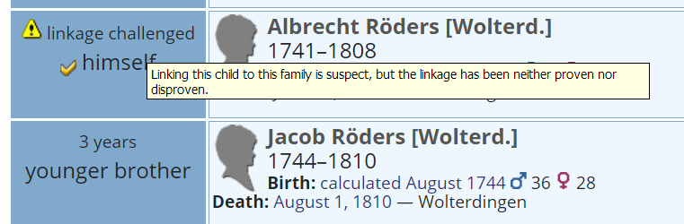

# ⚶ Vesta Families (Webtrees 2 Custom Module)

This [webtrees](https://www.webtrees.net/) custom module provides an extended 'Families' tab, with hooks for other custom modules.
The project’s website is [cissee.de](https://cissee.de).

This is a webtrees 2.x module - It cannot be used with webtrees 1.x. For its webtrees 1.x counterpart, see [here](https://github.com/ric2016/relatives_with_hooks).

## Contents

* [Features](#features)
* [Download](#download)
* [Installation](#installation)
* [License](#license)

### Features<a name="features"/>

Mainly intended as a base for other custom modules. One feature is available independently:

* Basic support for the GEDCOM child linkage status field (currently editable only via raw GEDCOM, this is a FAMC attribute which allows to mark family - child relations as challenged, proven or disproven):

### Download<a name="download"/>

* Current version: 2.0.11.4.0
* Based on and tested with webtrees 2.0.11. Requires webtrees 2.0.9 or later.
* Requires the ⚶ Vesta Common module ('vesta_common').
* Download the zipped module, including all related modules, [here](https://cissee.de/vesta.latest.zip).
* Support, suggestions, feature requests: <ric@richard-cissee.de>
* Issues also via <https://github.com/vesta-webtrees-2-custom-modules/vesta_relatives/issues>
* Translations may be contributed via weblate: <https://hosted.weblate.org/projects/vesta-webtrees-custom-modules/>

### Installation<a name="installation"/>

* Unzip the files and copy the contents of the modules_v4 folder to the respective folder of your webtrees installation. All related modules are included in the zip file. It's safe to overwrite the respective directories if they already exist (they are bundled with other custom modules as well), as long as other custom models using these dependencies are also upgraded to their respective latest versions.
* Enable the extended 'Families' module via Control Panel -> Modules -> All modules -> ⚶ Vesta Families.
* Configure the visibility of the old and the extended 'Families' tab via Control Panel -> Modules -> Tabs (usually, you'll want to use only one of them. You may just disable the original 'Families' module altogether).

### License<a name="license"/>

* **vesta_relatives: a webtrees custom module**
* Copyright (C) 2019 – 2021 Richard Cissée
* Derived from **webtrees** - Copyright 2021 webtrees development team.
* Dutch translations provided by TheDutchJewel.
* Czech translations provided by Josef Prause.
* Further translations contributed via weblate.

This program is free software: you can redistribute it and/or modify
it under the terms of the GNU General Public License as published by
the Free Software Foundation, either version 3 of the License, or
(at your option) any later version.

This program is distributed in the hope that it will be useful,
but WITHOUT ANY WARRANTY; without even the implied warranty of
MERCHANTABILITY or FITNESS FOR A PARTICULAR PURPOSE. See the
GNU General Public License for more details.

You should have received a copy of the GNU General Public License
along with this program. If not, see <http://www.gnu.org/licenses/>.
